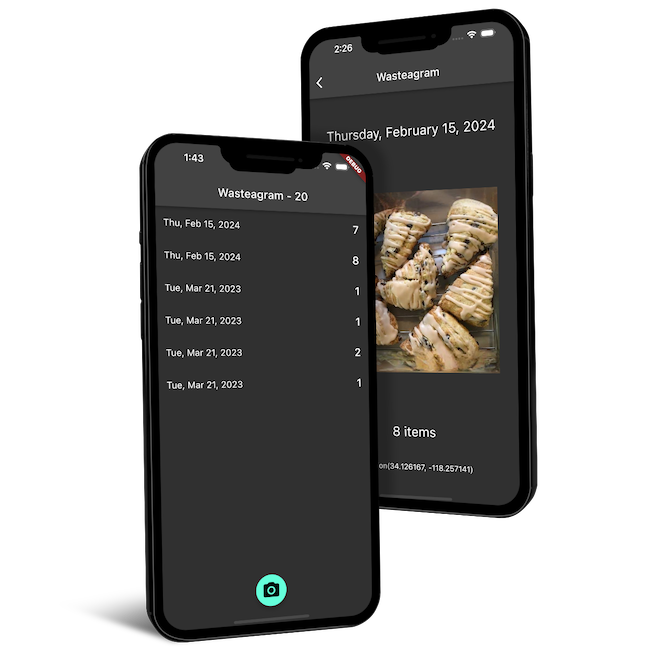

# CS 492 Mobile
A collection of Flutter projects created for the Mobile App Development course in Oregon State University's Computer Science Program.

     

## business-card

## mood-journal

## name-generator

## wasteagram

