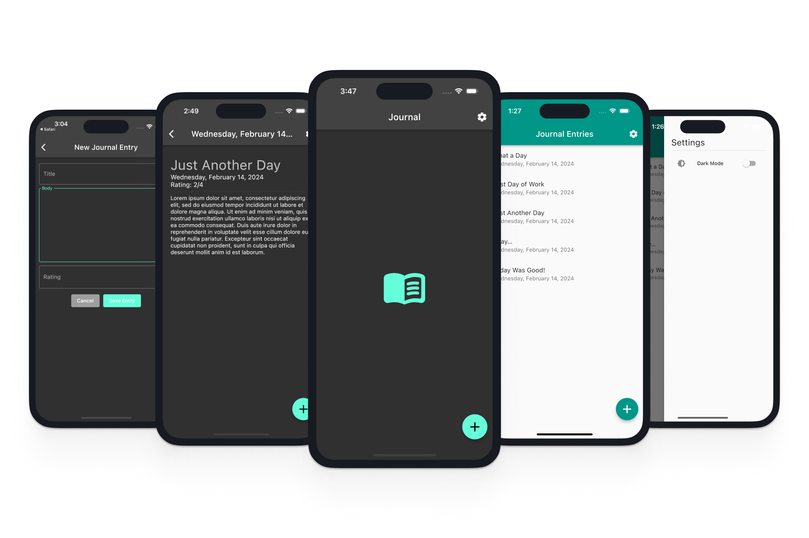

# Mood Journal
  

A cross-platform mobile app enabling users to create journal entries to track daily mood.

### Features
- Create new entries with inputs for a title, body, and rating
- Saves the current date to new entries
- View a list of journal entries saved to SQLite
- View details of a specific journal entry
- Toggle dark and light mode and saves preferences between sessions

